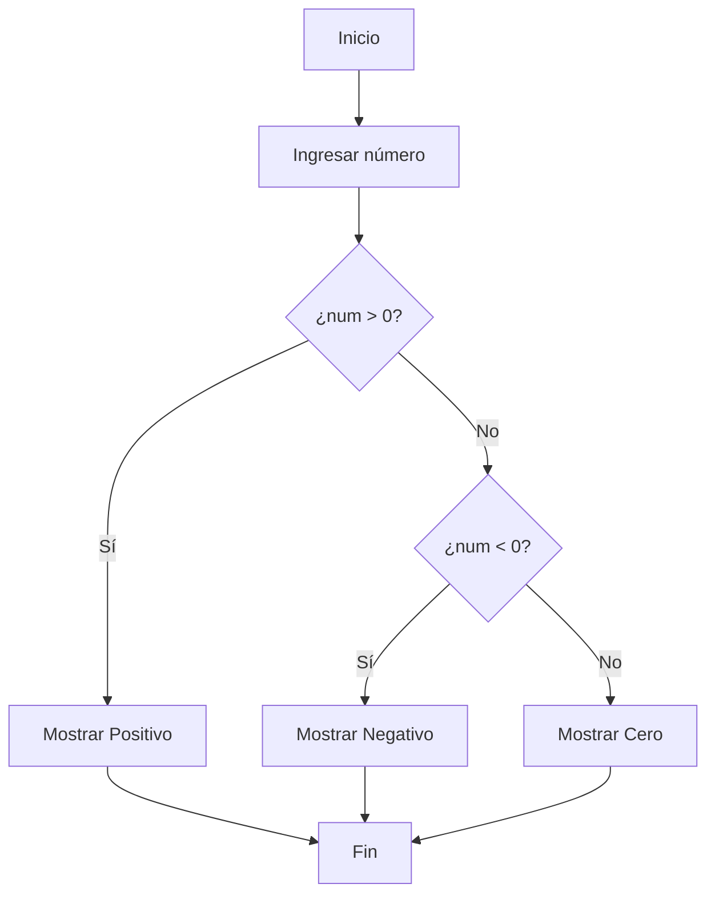
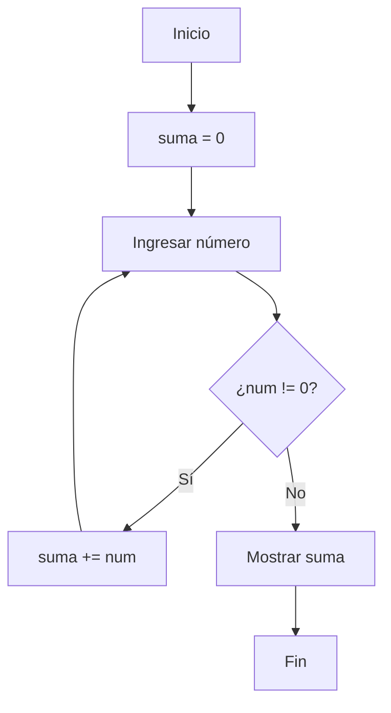
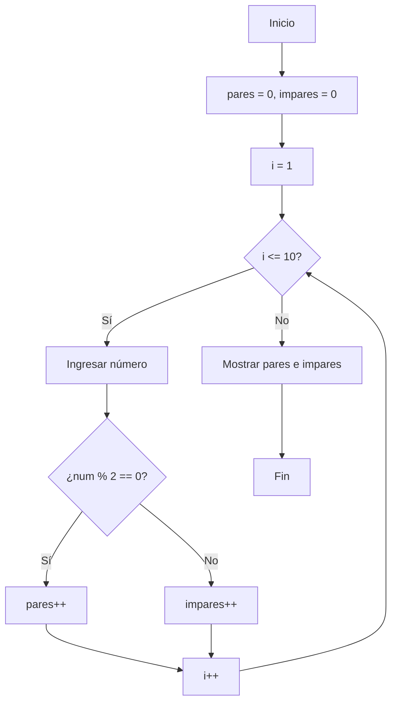
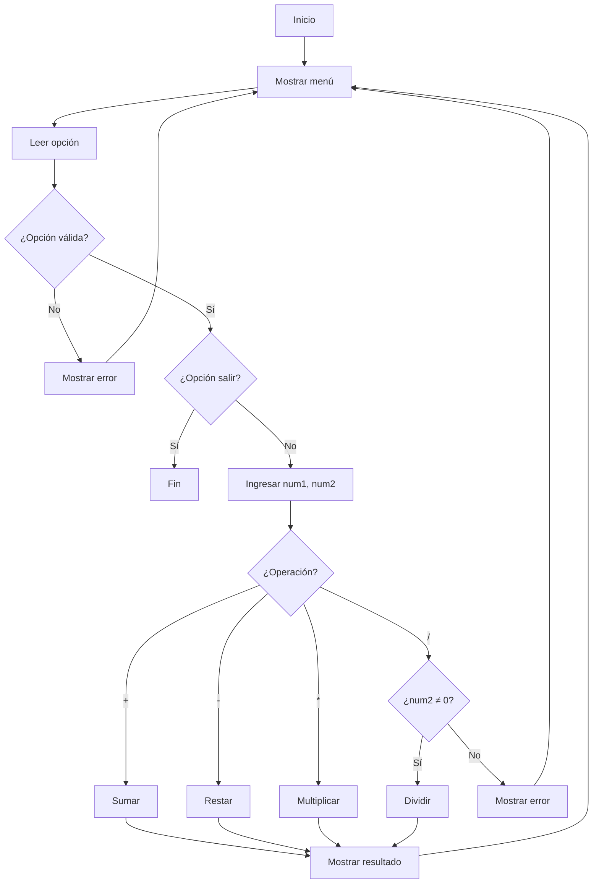
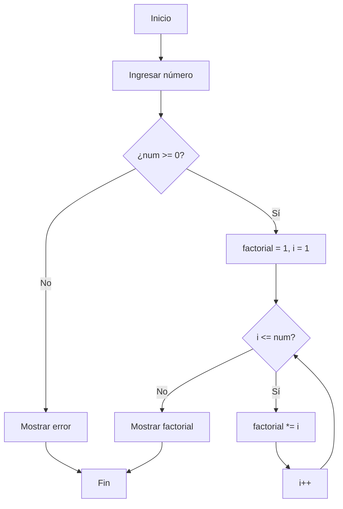

# Ejercicios para Convertir de Diagramas de Flujo a C#

## Ejercicio N° 1 

```mermaid
flowchart TD
    A[Inicio] --> B[Ingresar número]
    B --> C{¿num > 0?}
    C -->|Sí| D[Mostrar Positivo]
    C -->|No| E{¿num < 0?}
    E -->|Sí| F[Mostrar Negativo]
    E -->|No| G[Mostrar Cero]
    D --> H[Fin]
    F --> H
    G --> H
```

## Ejercicio N° 2

```mermaid
flowchart TD
    A[Inicio] --> B[suma = 0]
    B --> C[Ingresar número]
    C --> D{¿num != 0?}
    D -->|Sí| E[suma += num]
    E --> C
    D -->|No| F[Mostrar suma]
    F --> G[Fin]
```

## Ejercicio N° 3

```mermaid
flowchart TD
    A[Inicio] --> B[pares = 0, impares = 0]
    B --> C[i = 1]
    C --> D{i <= 10?}
    D -->|Sí| E[Ingresar número]
    E --> F{¿num % 2 == 0?}
    F -->|Sí| G[pares++]
    F -->|No| H[impares++]
    G --> I[i++]
    H --> I
    I --> D
    D -->|No| J[Mostrar pares e impares]
    J --> K[Fin]
```

## Ejercicio N° 4

```mermaid
flowchart TD
    A[Inicio] --> B[Mostrar menú]
    B --> C[Leer opción]
    C --> D{¿Opción válida?}
    D -->|No| E[Mostrar error]
    E --> B
    D -->|Sí| F{¿Opción salir?}
    F -->|Sí| G[Fin]
    F -->|No| H[Ingresar num1, num2]
    H --> I{¿Operación?}
    I -->|+| J[Sumar]
    I -->|-| K[Restar]
    I -->|*| L[Multiplicar]
    I -->|/| M{¿num2 ≠ 0?}
    M -->|Sí| N[Dividir]
    M -->|No| O[Mostrar error]
    J --> P[Mostrar resultado]
    K --> P
    L --> P
    N --> P
    O --> B
    P --> B
```

## Ejercicio N° 5

```mermaid
flowchart TD
    A[Inicio] --> B[Ingresar número]
    B --> C{¿num >= 0?}
    C -->|No| D[Mostrar error]
    C -->|Sí| E[factorial = 1, i = 1]
    E --> F{i <= num?}
    F -->|Sí| G[factorial *= i]
    G --> H[i++]
    H --> F
    F -->|No| I[Mostrar factorial]
    D --> J[Fin]
    I --> J
```
