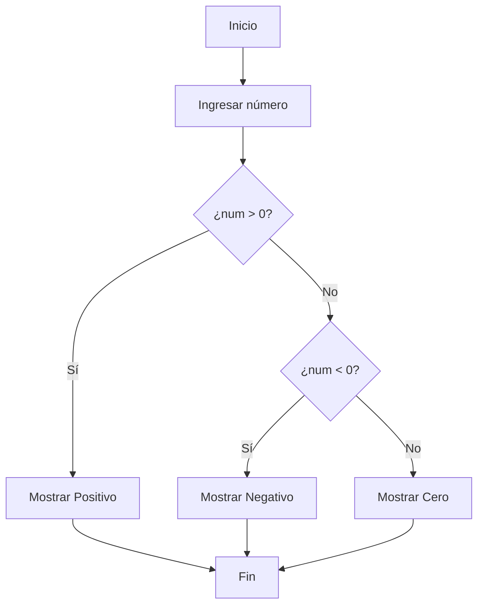
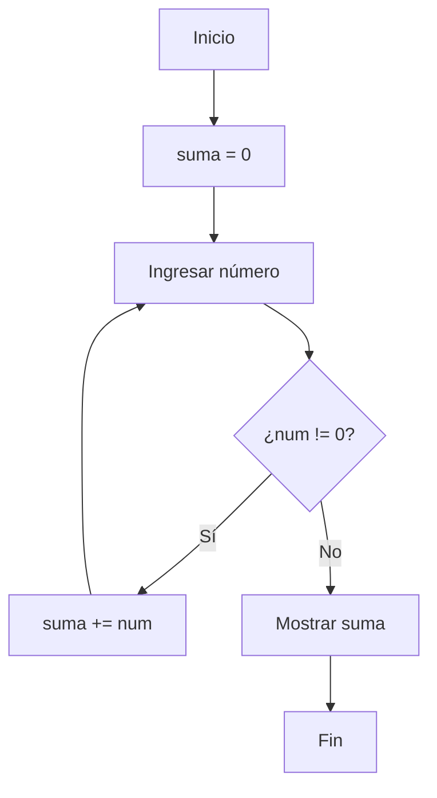
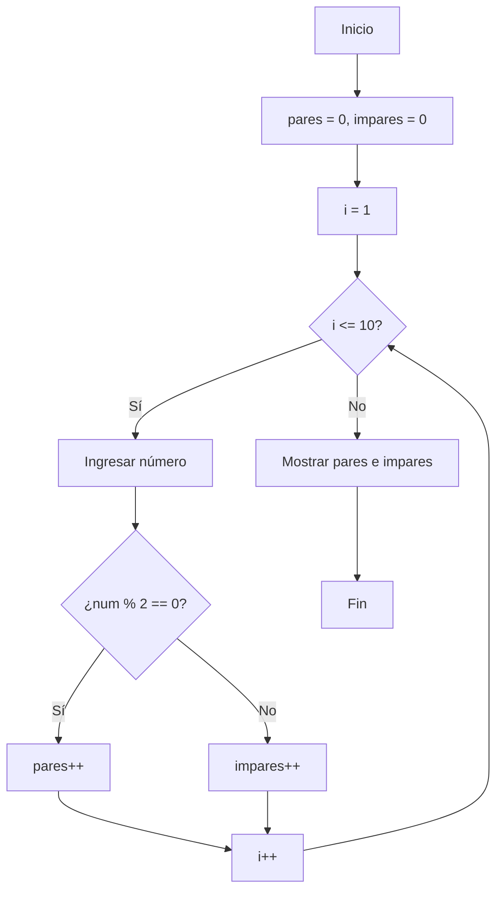
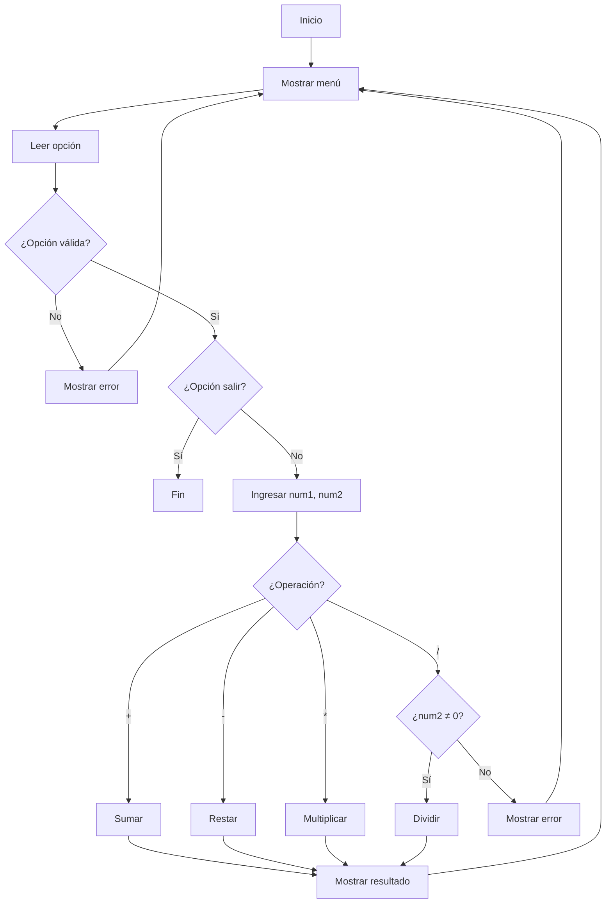
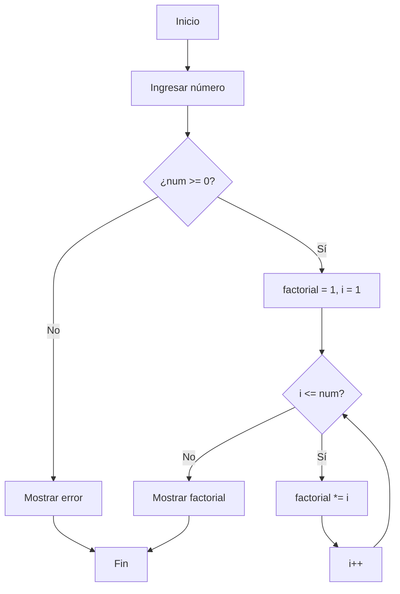

# Ejercicios para Convertir Diagramas de Flujo a C#

## Ejercicio N° 1 


## Ejercicio N° 2


## Ejercicio N° 3


## Ejercicio N° 4


## Ejercicio N° 5


# Ejercicios en C# para Interpretar la salida de programa
## Ejercicio 1: Salida de un bucle for
```csharp
using System;

class Program
{
    static void Main()
    {
        for (int i = 3; i < 8; i += 2)
        {
            Console.WriteLine($"Valor: {i}, Cuadrado: {i * i}");
        }
    }
}
```
**Preguntas:**

* ¿Cuántas iteraciones tendrá el bucle?

* ¿Qué valores se mostrarán para "Valor"?

* ¿Qué valores se mostrarán para "Cuadrado"?

* ¿Cuál será la última línea de salida?

## Ejercicio 2: Salida condicional anidada
```csharp
using System;

class Program
{
    static void Main()
    {
        int x = 12, y = 8;
        
        if (x > 10)
        {
            if (y < 10)
            {
                Console.WriteLine("Caso A");
            }
            else
            {
                Console.WriteLine("Caso B");
            }
        }
        else if (x + y > 15)
        {
            Console.WriteLine("Caso C");
        }
        else
        {
            Console.WriteLine("Caso D");
        }
    }
}
```
**Preguntas:**

* ¿Qué caso se imprimirá en la salida?

* ¿Qué pasaría si cambiamos y = 8 por y = 12?

* ¿Qué pasaría si cambiamos x = 12 por x = 9?

## Ejercicio 3: Salida de un bucle while con acumulador
```csharp
using System;

class Program
{
    static void Main()
    {
        int contador = 0;
        int suma = 0;
        
        while (contador < 5)
        {
            suma += contador * 2;
            Console.WriteLine($"Iteración: {contador}, Suma parcial: {suma}");
            contador++;
        }
        
        Console.WriteLine($"Suma total: {suma}");
    }
}
```
**Preguntas:**

* ¿Cuántas veces se ejecutará el bucle?

* ¿Cuáles son los valores de "Suma parcial" en cada iteración?

* ¿Cuál será el valor final de "Suma total"?

## Ejercicio 5: Salida del bucle
```csharp
using System;

class Program
{
    static void Main()
    {
        Console.WriteLine("Ingrese 5 números:");
        
        Console.Write("Número 1: ");
        int num1 = Convert.ToInt32(Console.ReadLine());
        
        Console.Write("Número 2: ");
        int num2 = Convert.ToInt32(Console.ReadLine());
        
        Console.Write("Número 3: ");
        int num3 = Convert.ToInt32(Console.ReadLine());
        
        Console.Write("Número 4: ");
        int num4 = Convert.ToInt32(Console.ReadLine());
        
        Console.Write("Número 5: ");
        int num5 = Convert.ToInt32(Console.ReadLine());
        
        int mayor = num1;
        
        if (num2 > mayor) mayor = num2;
        if (num3 > mayor) mayor = num3;
        if (num4 > mayor) mayor = num4;
        if (num5 > mayor) mayor = num5;
        
        Console.WriteLine($"Los números ingresados fueron: {num1}, {num2}, {num3}, {num4}, {num5}");
        Console.WriteLine($"El número mayor es: {mayor}");
    }
}
```
**Preguntas:**

* ¿Qué pasaría si todos los números fueran iguales?

* ¿Cómo se modificaría el programa para encontrar el número menor?

* ¿Qué ocurre si se ingresa un valor no numérico?
